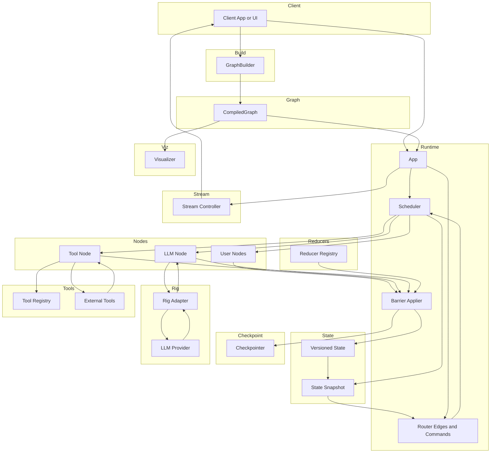

# Weavegraph

> NOTE: `NodeKind::Start` and `NodeKind::End` are virtual structural endpoints.  
> You never register them with `add_node`; attempts to do so are ignored with a warning.  
> Define only your executable (custom) nodes and connect them with edges from `Start` and to `End`.


[](https://crates.io/crates/weavegraph)
[](https://docs.rs/weavegraph)
[](https://opensource.org/licenses/MIT)

**Graph-driven, concurrent agent workflow framework with versioned state, deterministic barrier merges, and rich diagnostics.**

Weavegraph is a modern Rust framework for building complex, stateful workflows using graph-based execution. It's designed for AI agents, data processing pipelines, and any application requiring sophisticated state management with concurrent node execution.

## ✨ Key Features

- **🔄 Concurrent Graph Execution**: Bounded-concurrency scheduler with dependency resolution and versioned barrier synchronization
- **📝 Rich Message System**: Type-safe message construction with role-based messaging for AI workflows
- **🎯 Versioned State Management**: Channel-based state with snapshot isolation and deterministic merges
- **🚨 Comprehensive Error Handling**: Structured error propagation with beautiful diagnostics via `miette` and `thiserror`
- **📊 Built-in Observability**: Rich tracing spans and event streaming for monitoring and debugging
- **💾 Flexible Persistence**: SQLite checkpointing with automatic schema management, plus in-memory options
- **🎭 Conditional Workflows**: Dynamic routing and edge conditions based on runtime state
- **🔧 Developer Experience**: Extensive examples, comprehensive docs, and ergonomic APIs

## 🚀 Quick Start

Add Weavegraph to your `Cargo.toml`:

```toml
[dependencies]
weavegraph = "0.1"
```

### Basic Example

```rust
use weavegraph::{
    graph::GraphBuilder,
    message::Message,
    node::{Node, NodeContext, NodePartial},
    state::VersionedState,
};
use async_trait::async_trait;

// Define a simple greeting node
struct GreetingNode;

#[async_trait]
impl Node for GreetingNode {
    async fn run(
        &self,
        _snapshot: weavegraph::state::StateSnapshot,
        ctx: NodeContext,
    ) -> Result<NodePartial, weavegraph::node::NodeError> {
        ctx.emit("greeting", "Generating welcome message")?;

        let greeting = Message::assistant("Hello! How can I help you today?");

        Ok(NodePartial::new().with_messages(vec![greeting]))
    }
}

#[tokio::main]
async fn main() -> miette::Result<()> {
    // Build a simple graph with a virtual Start -> greet -> End topology.
    use weavegraph::types::NodeKind;
    let app = GraphBuilder::new()
        .add_node(NodeKind::Custom("greet".into()), GreetingNode)
        .add_edge(NodeKind::Start, NodeKind::Custom("greet".into()))
        .add_edge(NodeKind::Custom("greet".into()), NodeKind::End)
        .compile();

    // Create initial state and run
    let state = VersionedState::new_with_user_message("Hello, system!");
    let result = app.invoke(state).await?;

    // Access results
    for message in result.messages.snapshot() {
        println!("{}: {}", message.role, message.content);
    }

    Ok(())
}
```

## 📋 Core Concepts

### Messages

Messages are the primary communication primitive with convenient constructors:

```rust
use weavegraph::message::Message;

// Use convenience constructors (recommended)
let user_msg = Message::user("What's the weather like?");
let assistant_msg = Message::assistant("It's sunny and 75°F!");
let system_msg = Message::system("You are a helpful assistant.");

// For custom roles
let function_msg = Message::new("function", "Processing complete");

// Complex cases with builder pattern
let complex_msg = Message::builder()
    .role("custom_agent")
    .content("Task completed successfully")
    .build();
```

### State Management

Versioned state with channel isolation and snapshot consistency:

```rust
use weavegraph::state::VersionedState;

// Simple initialization
let state = VersionedState::new_with_user_message("Hello!");

// Rich initialization with builder
let state = VersionedState::builder()
    .with_user_message("What's the weather?")
    .with_system_message("You are a weather assistant")
    .with_extra("location", serde_json::json!("San Francisco"))
    .build();
```

### Graph Building

Declarative workflow definition with conditional routing:

```rust
use weavegraph::graphs::GraphBuilder;
use weavegraph::types::NodeKind;
use std::sync::Arc;

let graph = GraphBuilder::new()
    .add_node(NodeKind::Custom("input".into()), InputProcessorNode)
    .add_node(NodeKind::Custom("analyze".into()), AnalyzerNode)
    .add_node(NodeKind::Custom("respond".into()), ResponseNode)
    .add_node(NodeKind::Custom("escalate".into()), EscalateNode)
    // Virtual Start/End: connect from Start and into End explicitly
    .add_edge(NodeKind::Start, NodeKind::Custom("input".into()))
    .add_edge(NodeKind::Custom("input".into()), NodeKind::Custom("analyze".into()))
  .add_conditional_edge(
    NodeKind::Custom("analyze".into()),
    Arc::new(|state| {
      if state.extra.contains_key("needs_escalation") {
        "escalate".to_string()
      } else {
        "respond".to_string()
      }
    })
  )
    .add_edge(NodeKind::Custom("respond".into()), NodeKind::End)
    .add_edge(NodeKind::Custom("escalate".into()), NodeKind::End)
    .compile();
```

Note: Conditional predicates must return the name of a valid next node or a virtual endpoint. The runtime accepts:
- Custom nodes by name (e.g., "respond", "escalate") that were registered via add_node
- The virtual endpoints "Start" and "End"
If a predicate returns an unknown target, the route is skipped and a warning is logged.

### Conditional Edges

Use conditional edges to route dynamically based on runtime state. Predicates return target node names (Vec<String>), allowing flexible routing to single or multiple nodes.

Compact example:

```rust
use std::sync::Arc;
use weavegraph::graphs::{GraphBuilder, EdgePredicate};
use weavegraph::types::NodeKind;

let route: EdgePredicate = Arc::new(|snap| {
  if snap.extra.contains_key("needs_escalation") {
    vec!["escalate".to_string()]
  } else {
    vec!["respond".to_string()]
  }
});

let app = GraphBuilder::new()
  .add_node(NodeKind::Custom("analyze".into()), AnalyzeNode)
  .add_node(NodeKind::Custom("respond".into()), RespondNode)
  .add_node(NodeKind::Custom("escalate".into()), EscalateNode)
  .add_edge(NodeKind::Start, NodeKind::Custom("analyze".into()))
  .add_conditional_edge(NodeKind::Custom("analyze".into()), route)
  .add_edge(NodeKind::Custom("respond".into()), NodeKind::End)
  .add_edge(NodeKind::Custom("escalate".into()), NodeKind::End)
  .compile();
```

Troubleshooting:
- If nothing happens after a node with a conditional edge, ensure the predicate returns valid target names matching registered nodes, or the virtual endpoints "Start"/"End".
- For readability, use small helper predicates (EdgePredicate) and unit test them with sample StateSnapshots.

## 🔧 Examples

The repository includes comprehensive examples demonstrating various patterns and integrations. See `weavegraph/examples/README.md` for detailed information on running examples, including which ones require specific Cargo features.

```bash
# Basic node patterns and message handling
cargo run --example basic_nodes

# Advanced patterns: error handling, conditional routing, data transformation
cargo run --example advanced_patterns

# Error handling and pretty diagnostics
cargo run --example errors_pretty
```

### Demo Applications

Historical demo applications showcase evolution of capabilities:

```bash
# Basic graph execution patterns (examples/demo1.rs)
cargo run --example demo1

# Direct scheduler usage and barrier synchronization (examples/demo2.rs)
cargo run --example demo2

# LLM workflows with Ollama integration (examples/demo3.rs)
cargo run --example demo3

# Advanced multi-step workflows (examples/demo4.rs)
cargo run --example demo4
```

**Note**: Demo3 requires Ollama running at `http://localhost:11434` with models like `gemma3`. Use the provided `docker-compose.yml` to set up Ollama:

```bash
docker-compose up -d ollama
```

## 🏗️ Architecture

Weavegraph is built around several core modules:

- **[`message`]** - Type-safe message construction and role-based messaging
- **[`state`]** - Versioned state management with channel isolation
- **[`node`]** - Node execution primitives and async trait definitions
- **[`graph`]** - Workflow graph definition and conditional routing
- **[`schedulers`]** - Concurrent execution with dependency resolution
- **[`runtimes`]** - High-level execution runtime and checkpointing
- **[`channels`]** - Channel-based state storage and versioning
- **[`reducers`]** - State merge strategies and conflict resolution
- **[`event_bus`]** - Event streaming and observability infrastructure

## 🔍 Observability & Debugging

### Tracing

Rich tracing integration with configurable log levels:

```bash
# Debug level for weavegraph modules
RUST_LOG=debug cargo run --example basic_nodes

# Error level globally, debug for weavegraph
RUST_LOG=error,weavegraph=debug cargo run --example advanced_patterns
```

### Event Streaming ⭐

Weavegraph provides multiple patterns for streaming workflow events:

#### Simple Pattern (CLI Tools & Scripts)

Use convenience methods for single-execution scenarios:

```rust
// Pattern 1: Single channel (simplest)
let (result, events) = app.invoke_with_channel(initial_state).await;

// Collect events while processing
tokio::spawn(async move {
    while let Ok(event) = events.recv_async().await {
        println!("Event: {:?}", event);
    }
});

// Pattern 2: Multiple sinks
use weavegraph::event_bus::{StdOutSink, ChannelSink};

app.invoke_with_sinks(
    initial_state,
    vec![
        Box::new(StdOutSink::default()),
        Box::new(ChannelSink::new(tx)),
    ]
).await?;
```

See `cargo run --example convenience_streaming` for complete examples.

#### Production Pattern (Web Servers)

For per-request isolation with SSE/WebSocket:

```rust
use weavegraph::event_bus::{EventBus, ChannelSink};
use weavegraph::runtimes::AppRunner;

// Per-request EventBus with isolated channel
let (tx, rx) = flume::unbounded();
let bus = EventBus::with_sinks(vec![Box::new(ChannelSink::new(tx))]);

let mut runner = AppRunner::with_options_and_bus(
    app.clone(),
    Some(checkpointer),
    session_id.clone(),
    bus,
    true
).await;

// Stream events to client while workflow runs
tokio::spawn(async move {
    runner.run_until_complete(&session_id).await
});

// Events include node starts/completions, state changes, errors
```

See `cargo run --example streaming_events` and `STREAMING_QUICKSTART.md` for full details.

#### Testing Pattern

Use `MemorySink` for synchronous event capture in tests:

```rust
use weavegraph::event_bus::{EventBus, MemorySink};

let sink = MemorySink::new();
let event_bus = EventBus::with_sink(sink.clone());
let runner = AppRunner::with_bus(graph, event_bus);

// After execution
let events = sink.snapshot();
assert_eq!(events.len(), 5);
```

### Error Diagnostics

Beautiful error reporting with context and suggestions:

```rust
// Automatic error context and pretty printing
fn main() -> miette::Result<()> {
    // Your workflow code here
    Ok(())
}
```

## 💾 Persistence

### SQLite Checkpointing

Automatic state persistence with configurable database location:

```rust
use weavegraph::runtimes::SqliteCheckpointer;

let checkpointer = SqliteCheckpointer::new("sqlite://workflow.db").await?;
let runner = AppRunner::with_checkpointer(graph, checkpointer);
```

Database URL resolution order:
1. `WEAVEGRAPH_SQLITE_URL` environment variable
2. Explicit URL in code
3. `SQLITE_DB_NAME` environment variable (filename only)
4. Default: `sqlite://weavegraph.db`

### In-Memory Mode

For testing and ephemeral workflows:

```rust
let runner = AppRunner::new(graph); // Uses in-memory state
```

## 🧪 Testing

Run the comprehensive test suite:

```bash
# All tests with output
cargo test --all -- --nocapture

# Specific test categories
cargo test schedulers:: -- --nocapture
cargo test channels:: -- --nocapture
cargo test integration:: -- --nocapture
```

Property-based testing with `proptest` ensures correctness across edge cases.


Overview mermain flowchart of the app



## 🚀 Production Considerations

### Performance

- Bounded concurrency prevents resource exhaustion
- Snapshot isolation eliminates state races
- Channel-based architecture enables efficient partial updates
- SQLite checkpointing supports failure recovery

### Monitoring

- Structured event streaming for observability platforms
- Rich tracing spans for distributed tracing
- Error aggregation and pretty diagnostics
- Custom event sinks for metrics collection

### Deployment

- Docker-ready with provided compose configuration
- Environment-based configuration
- Graceful shutdown handling
- Migration support for schema evolution

## 🎓 Project Background

Weavegraph originated as a capstone project for a Rust online course, developed by contributors with Python backgrounds and experience with LangGraph and LangChain. The goal was to bring similar graph-based workflow capabilities to Rust while leveraging its performance, safety, and concurrency advantages.

While rooted in educational exploration, Weavegraph has evolved into a production-ready framework with continued active development well beyond the classroom setting.

## 🤝 Contributing

We welcome contributions! Please see our [contributing guidelines](CONTRIBUTING.md) for details.

Areas we're particularly interested in:
- Additional persistence backends (PostgreSQL, Redis)
- Enhanced AI/LLM integration patterns
- Performance optimizations
- Documentation improvements
- Example applications

## 📄 License

This project is licensed under the MIT License - see the [LICENSE](LICENSE) file for details.

## 🔗 Links

- [Documentation](https://docs.rs/weavegraph)
- [Crates.io](https://crates.io/crates/weavegraph)
- [Repository](https://github.com/Idleness76/weavegraph)
- [Issues](https://github.com/Idleness76/weavegraph/issues)
