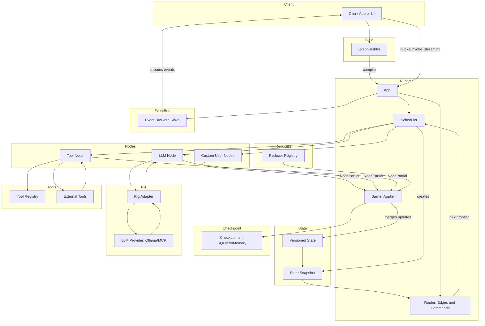

# Architecture Overview

Comprehensive technical documentation for Weavegraph's internal design and module organization.

**Related Documentation:**
- [Developer Guide](GUIDE.md) - Core concepts, messages, state, and graphs
- [Operations Guide](OPERATIONS.md) - Event streaming, persistence, testing, and production
- [Documentation Index](INDEX.md) - Complete reference with anchor links

## 🎓 Project Background

Weavegraph originated as a capstone project for a Rust online course, developed by contributors with Python/TypeScript backgrounds and experience with LangGraph and LangChain. The goal was to bring similar graph-based workflow capabilities to Rust while leveraging its performance, safety, and concurrency advantages.

While rooted in educational exploration, Weavegraph continues active development well beyond the classroom setting. The core architecture is solid and the framework is functional, but as an early beta release (v0.1.x), it's still maturing—use with awareness of ongoing API evolution.


| Crate | Purpose | Highlights |
| ----- | ------- | ---------- |
| `weavegraph` | Executes concurrent, stateful graphs with structured observability. | Graph builder + runtime, event bus, checkpointing, reducers, scheduler. |
| `wg-ragsmith` | Provides ingestion, semantic chunking, and storage utilities for RAG workloads. | HTML/JSON parsers, semantic chunkers, SQLite vector store helpers. |


## Overview flowchart of the app (mermaid)



---

## Workspace Topology

```
docs/                     → Architectural plans, production hardening roadmap.
weavegraph/               → Core orchestration crate (library + examples + tests).
wg-ragsmith/              → RAG utilities crate (library + examples + tests).
data/                     → Local development databases (ignored in version control).
external/                 → Vendor snapshots (RAGatouille, raptor) kept outside the workspace.
.github/workflows/        → Continuous integration pipelines.
Makefile                  → Developer/CI task runner (fmt, clippy, test, doc, deny, machete, migrations).
ARCHITECTURE.md           → This document.
```

The workspace targets Rust 1.91 as the minimum supported version and enables 2024 edition
features across both crates.

---

## `weavegraph` Crate

`weavegraph` implements the runtime that powers concurrent, graph-based workflows. The library
is organised around a handful of core modules:

| Module | Highlights |
| ------ | ---------- |
| `graphs::{builder, edges, compilation}` | `GraphBuilder` DSL for wiring nodes, unconditional and conditional edges, and compiling into a runnable `App`. |
| `app` | High-level façade that owns compiled nodes/edges, reducer registry, and runtime config. Provides `invoke`, `invoke_streaming`, and event stream APIs. |
| `runtimes::{runner, checkpointer_*, runtime_config}` | `AppRunner` drives supersteps, coordinates the scheduler, applies barriers, and persists to SQLite (via `sqlx::migrate!`). |
| `schedulers` | Dependency-aware scheduler that fans out runnable nodes and enforces bounded concurrency. |
| `node` | `Node` trait, `NodeContext`, `NodePartial`, and error types used by application code. |
| `state`, `channels`, `reducers` | Versioned state model split across message/extra/error channels with deterministic merge reducers. |
| `event_bus` | Broadcast-based event hub with sinks (stdout, memory, channel, JSON Lines) and streaming helpers for web servers or CLIs. Events support JSON serialization for log aggregation. |
| `telemetry`, `utils` | Tracing helpers, deterministic RNG, clocks, ID generators, and collection utilities. |

### Authoring Nodes & State

Weavegraph applications revolve around three building blocks: nodes, state, and graphs.

> **Note:** `NodeKind::Start` and `NodeKind::End` are virtual structural endpoints.  
> You never register them with `add_node`; attempts to do so are ignored with a warning.  
> Define only your executable (custom) nodes and connect them with edges from `Start` and to `End`.

```rust
use weavegraph::{
    graphs::GraphBuilder,
    message::Message,
    node::{Node, NodeContext, NodePartial},
    state::VersionedState,
    types::NodeKind,
};
use async_trait::async_trait;

struct GreetingNode;

#[async_trait]
impl Node for GreetingNode {
    async fn run(
        &self,
        _snapshot: weavegraph::state::StateSnapshot,
        ctx: NodeContext,
    ) -> Result<NodePartial, weavegraph::node::NodeError> {
        ctx.emit("greeting", "Saying hi!")?;
        Ok(NodePartial::new().with_messages(vec![Message::assistant("Hello!")]))
    }
}

let app = GraphBuilder::new()
    .add_node(NodeKind::Custom("greet".into()), GreetingNode)
    .add_edge(NodeKind::Start, NodeKind::Custom("greet".into()))
    .add_edge(NodeKind::Custom("greet".into()), NodeKind::End)
    .compile()?;

let initial = VersionedState::new_with_user_message("Hi?");
let result = app.invoke(initial).await?;
```

**Key practices:**

- Prefer the convenience constructors on `Message` (`Message::user`, `Message::assistant`, etc.) - see [Messages](GUIDE.md#messages)
- Build state with `VersionedState::new_with_user_message` or the builder pattern - see [State Management](GUIDE.md#state)
- Use `NodeContext::emit*` helpers for telemetry instead of writing directly to stdout
- Return structured errors (`NodeError::MissingInput`, `NodeError::Provider`) or populate `NodePartial::with_errors` for recoverable issues - see [Error Handling](OPERATIONS.md#errors)

### Custom Reducers {#custom-reducers}

Weavegraph supports custom reducers for extending or replacing channel update behavior. By default,
three reducers are registered:

- **Message channel**: `AddMessages` – Appends messages to the message list
- **Extra channel**: `MapMerge` – Shallow merges JSON objects in the extra data map
- **Error channel**: `AddErrors` – Appends error events to the error list

To register custom reducers:

```rust
use std::sync::Arc;
use weavegraph::reducers::{Reducer, ReducerRegistry};
use weavegraph::types::ChannelType;

// Define a custom reducer
struct MyCustomReducer;

impl Reducer for MyCustomReducer {
    fn apply(&self, state: &mut VersionedState, update: &NodePartial) {
        // Custom merge logic here
    }
}

// Register during graph building
let app = GraphBuilder::new()
    .add_node(...)
    .with_reducer(ChannelType::Message, Arc::new(MyCustomReducer))
    .compile()?;

// Or replace the entire registry
let custom_registry = ReducerRegistry::new()
    .with_reducer(ChannelType::Message, Arc::new(MyCustomReducer));

let app = GraphBuilder::new()
    .add_node(...)
    .with_reducer_registry(custom_registry)
    .compile()?;
```

Multiple reducers can be registered for the same channel and will be applied in registration order.
This enables middleware-style processing, validation, or transformation of channel updates during
barrier synchronization.

### Execution Flow

1. **Authoring** – Build a graph with `GraphBuilder`, registering nodes (implementations of `Node`)
   and the edges that connect them. Conditional edges can inspect `StateSnapshot` at runtime.
   See [Graph Building](GUIDE.md#graphs) for details.
2. **Compilation** – `GraphBuilder::compile()` validates topology and produces an `App`.
3. **Invocation** – `App::invoke()` (or streaming variants like `invoke_streaming`, `invoke_with_channel`)
   constructs an `AppRunner` with the chosen checkpointer (`InMemory` or SQLite), and event bus configuration.
   See [Event Streaming](OPERATIONS.md#event-streaming) for streaming patterns.
4. **Scheduling** – The scheduler selects runnable nodes, issues `NodeContext`s, and executes
   nodes concurrently. Each node returns a `NodePartial` with channel deltas and optional
   control-flow directives.
5. **Barrier & Reduction** – Reducers merge channel updates deterministically, update the
   versioned state, and hand control back to the scheduler for the next superstep.
   See [Custom Reducers](#custom-reducers) above.
6. **Persistence & Observability** – Checkpointer snapshots state into SQLite (when enabled),
   the event bus broadcasts diagnostics / LLM chunk streams, and telemetry surfaces to sinks.
   See [Persistence](OPERATIONS.md#persistence) and [Event Streaming](OPERATIONS.md#event-streaming).

### Optional Features

* `llm` – Enables Rig-based LLM support (Ollama/MCP integrations).
* `sqlite-migrations` – Turns on SQLite-backed persistence (default).
* `examples` – Pulls in `wg-ragsmith`, `reqwest`, and `scraper` for richer demos.

### Tests & Examples

* `weavegraph/tests/` – Covers state channels, reducers, scheduler semantics, checkpointer, and event bus.
  See [Testing](OPERATIONS.md#testing) for running tests and patterns.
* `weavegraph/examples/` – Progressive walkthroughs:
  * `basic_nodes.rs`, `demo1.rs`, `demo2.rs` show core messaging and state channels.
    See [Messages](GUIDE.md#messages) and [State](GUIDE.md#state).
  * `demo3.rs`, `demo4.rs`, `demo6_agent_mcp.rs` integrate LLM providers (Ollama/MCP),
    leveraging the `llm` feature.
  * `streaming_events.rs`, `convenience_streaming.rs`, `demo7_axum_sse.rs` demonstrate the
    broadcast event bus and web-friendly streaming patterns.
    See [Event Streaming](OPERATIONS.md#event-streaming).
  * `demo5_rag.rs` ties into `wg-ragsmith` to orchestrate a RAG pipeline end-to-end.

---

### Backpressure and Drop Policy

The event bus uses a bounded broadcast channel (default capacity: 1024 events per subscriber).
When a subscriber falls behind faster producers, the following semantics apply:

- Slow subscribers receive a lag notice and skip older events (no blocking of producers)
- Missed events are counted and exposed via sink diagnostics
- A WARN log entry is emitted with the number of dropped events and the running total
- Streams continue from the most recent position for graceful degradation under load

To adjust capacity, configure the event bus when using `App::invoke_streaming` or construct
an `EventBus` directly with custom capacity via `EventBus::with_capacity`.

For practical guidance and code samples, see:
- [Event Streaming](OPERATIONS.md#event-streaming) for patterns and sink configuration
- `weavegraph/examples/STREAMING_QUICKSTART.md` for detailed tuning guidance

## `wg-ragsmith` Crate

`wg-ragsmith` contains the ingestion and vector-store tooling used by RAG pipelines. It can be
used standalone or pulled into `weavegraph` via the `examples` feature.

| Module | Highlights |
| ------ | ---------- |
| `ingestion::{cache, chunk, resume}` | Disk-backed document cache, chunk-to-ingestion conversion, and resumable pipeline tracking. |
| `semantic_chunking::{html, json, segmenter, embeddings, service}` | HTML/JSON preprocessors, statistical breakpoint strategies, mock/real embedding providers, and the async chunking service. |
| `stores::sqlite` | `SqliteChunkStore` built on `rig-sqlite` + `sqlite-vec`, including schema, vec3 registration, and helper methods to upsert/search chunks. |
| `types` | `RagError` and supporting data structures for ingestion/persistence. |

### Examples

* `examples/rust_book_pipeline.rs` – Async ingestion pipeline that scrapes the Rust book,
  chunks and embeds sections, and writes them into SQLite.
* `examples/query_chunks.rs` & `query_db.sh` – Smoke tests showing how to query stored chunks.

These examples share environment variables with the weavegraph RAG demo (see `.env.example`).

### Feature Flags

* `semantic-chunking-tiktoken` (default) – OpenAI tiktoken tokeniser.
* `semantic-chunking-rust-bert` – Enables Rust-BERT based embedding pipeline.
* `semantic-chunking-segtok` – Alternative segmentation strategy.

---

## Shared Operational Pieces

* **Tooling** – The top-level `Makefile` standardises `cargo fmt`, `cargo clippy`,
  `cargo test`, `cargo doc`, `cargo deny`, `cargo machete`, and `sqlx` migrations so that
  local developers and CI run identical commands.
* **CI/CD** – `.github/workflows/ci.yml` runs the Makefile/`cargo` commands across three
  toolchains (`1.91.0`, current stable, nightly) and per workspace member to guard API evolution.
* **Migrations** – `weavegraph/migrations` houses the `sqlx` migration set for the SQLite
  checkpointer. The Makefile’s `migrate*` targets wrap `sqlx` CLI calls.
* **Docs** – `docs/` captures forward-looking design documents (event bus refactor,
  control-flow commands, hybrid RAG pipeline) and the production readiness plan. Use
  this architecture document as the entry point.

---
