```mermaid
graph TB
    subgraph "Phase 1 (Built)"
        Content["Content enum<br/>Text | Messages | ToolCall<br/>ToolResult | RetrievedChunks"]
        StageOutcome["StageOutcome enum<br/>Allow | Block | Transform<br/>Escalate | Skip"]
        GuardrailStage["GuardrailStage trait<br/>id() | evaluate() | degradable() | priority()"]
        SecurityContext["SecurityContext<br/>session_id | user_id | risk_score<br/>parent (delegation chain)"]
        PipelineExecutor["PipelineExecutor<br/>Priority-sorted execution<br/>FailMode integration<br/>⚠️ NEEDS FIX: Transform propagation"]
    end

    subgraph "Phase 2: prompt/ Module"
        SecureTemplate["SecureTemplate<br/>Builder pattern<br/>Typed placeholders<br/>Auto-escaping<br/>Injects honeytokens"]
        
        TemplateScanner["TemplateScanner<br/>implements GuardrailStage<br/>Priority: 30<br/>RegexSet for secrets<br/>Entropy detection"]
        
        RoleIsolation["RoleIsolation<br/>implements GuardrailStage<br/>Priority: 35<br/>Boundary markers<br/>Delimiter validation"]
        
        HoneytokenStore["HoneytokenStore<br/>⚠️ UTILITY not stage<br/>AES-256-GCM encryption<br/>generate() | detect() | rotate()"]
        
        RefusalPolicy["RefusalPolicy enum<br/>Block → StageOutcome::Block<br/>Redact → Transform<br/>SafeResponse → Transform<br/>Escalate → Escalate<br/>⚠️ INTERACTS WITH FailMode"]
    end

    subgraph "Phase 2: input/ Module"
        NormalizationStage["NormalizationStage<br/>implements GuardrailStage<br/>Priority: 10 (FIRST)<br/>Unicode NFKC<br/>HTML strip (lol_html)<br/>Control char removal<br/>⚠️ Returns Transform"]
        
        InjectionStage["InjectionStage<br/>implements GuardrailStage<br/>Priority: 40<br/>Composes detectors:<br/>• HeuristicDetector<br/>• StructuralAnalyzer<br/>• SpotlightDetector<br/>• (Future: MLClassifier)<br/>EnsembleScorer"]
        
        PatternLibrary["PatternLibrary<br/>⚠️ HYBRID DESIGN<br/>Static: 50+ patterns<br/>Runtime: JSON overrides"]
        
        HeuristicDetector["HeuristicDetector<br/>implements Detector trait<br/>Uses PatternLibrary<br/>RegexSet matching"]
        
        StructuralAnalyzer["StructuralAnalyzer<br/>implements Detector trait<br/>Char frequency analysis<br/>Instruction density<br/>Repetition detection"]
        
        SpotlightDetector["SpotlightDetector<br/>implements Detector trait<br/>RAG boundary markers<br/>Only for RetrievedChunks"]
        
        EnsembleScorer["EnsembleScorer<br/>AnyAboveThreshold<br/>WeightedAverage<br/>MajorityVote<br/>MaxScore"]
        
        Detector["⚠️ SEALED TRAIT<br/>trait Detector<br/>score() | name() | is_expensive()"]
    end

    subgraph "Execution Flow (⚠️ CRITICAL FIX NEEDED)"
        Input["User Input<br/>Content::Text"]
        
        Norm["Normalization<br/>Priority 10"]
        NormTransform["Transform:<br/>HTML stripped<br/>Unicode normalized"]
        
        Inj["Injection Detection<br/>Priority 40"]
        InjBlock["Block or Allow"]
        
        Final["Final Outcome"]
        
        Input --> Norm
        Norm --> NormTransform
        NormTransform -.->|"⚠️ BUG: Currently passes<br/>ORIGINAL content"| Inj
        NormTransform ==>|"SHOULD pass<br/>transformed content"| Inj
        Inj --> InjBlock
        InjBlock --> Final
    end

    subgraph "FailMode vs RefusalPolicy (⚠️ CLARIFY)"
        Stage["Stage detects threat"]
        Refusal["RefusalPolicy.apply()"]
        Outcome["StageOutcome"]
        FailModeDecision["FailMode gate"]
        FinalDecision["Final enforcement"]
        
        Stage --> Refusal
        Refusal --> Outcome
        Outcome -->|"Block/Escalate"| FailModeDecision
        Outcome -->|"Transform (Redact/SafeResponse)"| FinalDecision
        FailModeDecision -->|"Closed: enforce"| FinalDecision
        FailModeDecision -->|"Open/LogOnly: override to Allow"| FinalDecision
    end

    %% Relationships
    GuardrailStage -.->|"evaluates"| Content
    GuardrailStage -.->|"receives"| SecurityContext
    GuardrailStage -.->|"returns"| StageOutcome
    
    PipelineExecutor -->|"orchestrates"| GuardrailStage
    
    SecureTemplate -->|"uses"| HoneytokenStore
    TemplateScanner -->|"uses"| HoneytokenStore
    TemplateScanner -->|"implements"| GuardrailStage
    RoleIsolation -->|"implements"| GuardrailStage
    
    NormalizationStage -->|"implements"| GuardrailStage
    InjectionStage -->|"implements"| GuardrailStage
    
    InjectionStage -->|"composes"| HeuristicDetector
    InjectionStage -->|"composes"| StructuralAnalyzer
    InjectionStage -->|"composes"| SpotlightDetector
    InjectionStage -->|"uses"| EnsembleScorer
    
    HeuristicDetector -->|"implements"| Detector
    StructuralAnalyzer -->|"implements"| Detector
    SpotlightDetector -->|"implements"| Detector
    
    HeuristicDetector -->|"uses"| PatternLibrary
    
    TemplateScanner -->|"applies"| RefusalPolicy
    
    style Content fill:#e1f5e1
    style StageOutcome fill:#e1f5e1
    style GuardrailStage fill:#e1f5e1
    style SecurityContext fill:#e1f5e1
    style PipelineExecutor fill:#ffe1e1
    
    style HoneytokenStore fill:#fff3cd
    style RefusalPolicy fill:#ffe1e1
    style Detector fill:#e1f0ff
    style PatternLibrary fill:#fff3cd
    style NormTransform fill:#ffe1e1
    
    classDef critical fill:#ff6b6b,stroke:#c92a2a,color:#fff
    class PipelineExecutor,NormTransform,RefusalPolicy critical
    
    classDef warning fill:#ffd93d,stroke:#f08c00
    class HoneytokenStore,PatternLibrary,Detector warning
```

## Legend

- 🟩 **Green**: Phase 1 completed (stable foundation)
- 🟥 **Red**: Critical issues requiring immediate attention
- 🟨 **Yellow**: Design decisions needing clarification
- 🔵 **Blue**: Sealed trait pattern (public but controlled)

## Critical Path Issues

1. **Transform Propagation**: PipelineExecutor must pass `current_content` (mutated by Transform outcomes) to subsequent stages, not the original `content` parameter.

2. **RefusalPolicy/FailMode Hierarchy**: Transform outcomes (Redact, SafeResponse) bypass FailMode because they're remediations, not blocks.

3. **Spotlight Module Location**: Should be `input/injection/spotlight.rs`, not `input/spotlight.rs` (it's InjectionStage-specific).

## Priority Bands (Recommended)

```
0-19:   Preprocessing     (NormalizationStage = 10)
20-39:  Enrichment        (MultimodalStage = 20)  [Phase 3]
40-59:  Threat Detection  (InjectionStage = 40, PIIStage = 45)
60-79:  Post-processing   (reserved)
80-99:  Audit/Telemetry   (AuditStage = 90)  [Phase 6]
```
